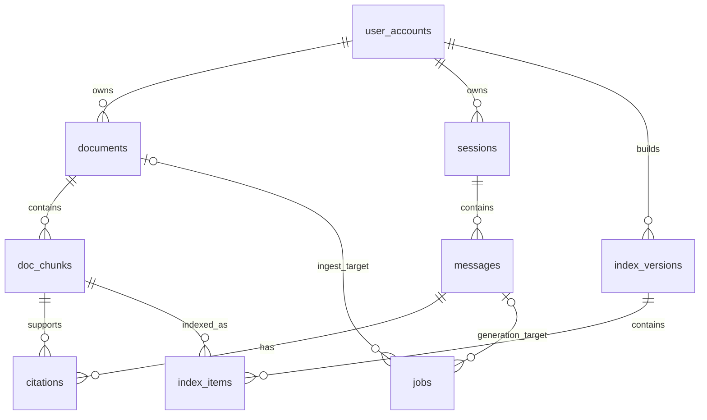

假设 `citations`（引用）表同时保存下面三个字段：

```text
message_id = 900
doc_id     = 10
chunk_id   = 205
chunk_index= 7
```

数据库检查后发现：message 900 存在，document 10 存在，chunk 205 也存在，所以 INSERT 成功。但 chunk 205 实际属于 document 20，ordinal 是 3。三个值各自满足外键或类型约束，组合起来却表达了一个不存在的来源。

这类错误对 RAG 系统尤其危险。页面仍能展示一条引用，模型回答也可能看起来合理，直到用户点击来源才发现跳到了另一份文档。它不是一次简单的“漏加外键”，而是表中保存了本可推导的重复事实，却没有约束这些事实必须一致。

原始 ER 草图还存在两个类似问题：把 document 与 index 画成一对一，导致 embedding 模型升级后无法保留旧索引；使用 `tasks(entity_type, entity_id)` 表达多态关联，数据库却不知道 `entity_id` 应该引用哪张表。

本文围绕这三类故障重建一个适合本地 RAG MVP 的关系模型。先用可运行的 SQLite 示例证明核心约束，再给出 MySQL/InnoDB 的工程 DDL、索引版本切换和跨 Redis 的一致性边界。目标不是设计一套“永远不改”的大而全 schema，而是让错误引用、错位向量和悬空任务在尽可能靠近写入的位置暴露。

## 1. 为什么给每个 ID 单独加外键仍然不够？

外键只验证它声明的关系：

```text
citations.doc_id   -> documents.id
citations.chunk_id -> doc_chunks.id
```

它不会自动知道下面的函数依赖：

```text
chunk_id -> document_id, ordinal, text
```

也就是说，只要知道 `chunk_id`，就能通过 `doc_chunks` 唯一确定所属文档、序号和原文。把这些值再次复制进 `citations`，便产生多个可独立更新的事实来源：

```text
doc_chunks: chunk 205 belongs to document 20
citations:  chunk 205 belongs to document 10
```

解决方向有三种：

| 方法 | 做法 | 适用条件 |
| --- | --- | --- |
| 删除冗余列 | citation 只保存 `chunk_id`，查询时 JOIN 得到 document | 首选，结构最清楚 |
| 复合外键 | citation 的 `(chunk_id, doc_id)` 引用 chunk 的唯一组合 | 确实需要同时存两列时 |
| 保存快照 | 保存当时的 snippet、标题等不可变展示信息 | 为历史审计有意反规范化 |

“删除冗余列”和“保存 snippet 快照”并不冲突。`doc_id` 是仍可从 chunk 推导的当前关系，通常不必复制；`snippet` 则可能是产品有意保存的历史证据，即使源文档以后重新切片，旧回答仍能展示当时引用的文字。快照要明确命名和用途，不能和当前源数据混为一谈。

## 2. 最小可运行版本：让错误引用在写入时失败

下面的 Python 3.9+ 程序使用标准库 `sqlite3` 建立内存数据库。它只保留 documents、chunks、messages 和 citations 四张核心表，用两次故意错误的 INSERT 验证主键、唯一约束和外键。

SQLite 与 MySQL 不是同一个数据库；该程序用于验证关系设计，不代表 MySQL DDL 可以直接复制到 SQLite。SQLite 还需要对每条连接显式启用 `PRAGMA foreign_keys = ON`。

```python
import sqlite3

SCHEMA = """
PRAGMA foreign_keys = ON;

CREATE TABLE documents (
    id TEXT PRIMARY KEY,
    title TEXT NOT NULL
);

CREATE TABLE doc_chunks (
    id TEXT PRIMARY KEY,
    document_id TEXT NOT NULL,
    ordinal INTEGER NOT NULL CHECK (ordinal >= 0),
    text TEXT NOT NULL,
    UNIQUE (document_id, ordinal),
    FOREIGN KEY (document_id)
        REFERENCES documents(id) ON DELETE CASCADE
);

CREATE TABLE messages (
    id TEXT PRIMARY KEY,
    content TEXT NOT NULL
);

CREATE TABLE citations (
    message_id TEXT NOT NULL,
    chunk_id TEXT NOT NULL,
    rank INTEGER NOT NULL CHECK (rank > 0),
    score REAL NOT NULL,
    snippet TEXT NOT NULL,
    PRIMARY KEY (message_id, rank),
    UNIQUE (message_id, chunk_id),
    FOREIGN KEY (message_id)
        REFERENCES messages(id) ON DELETE CASCADE,
    FOREIGN KEY (chunk_id)
        REFERENCES doc_chunks(id) ON DELETE RESTRICT
);
"""

def insert_is_rejected(
    connection: sqlite3.Connection,
    sql: str,
    parameters: tuple[object, ...],
) -> bool:
    try:
        connection.execute(sql, parameters)
    except sqlite3.IntegrityError:
        return True
    return False

def main() -> None:
    connection = sqlite3.connect(":memory:")
    try:
        connection.executescript(SCHEMA)
        connection.executemany(
            "INSERT INTO documents(id, title) VALUES (?, ?)",
            (("doc-a", "Redis Notes"), ("doc-b", "FAISS Notes")),
        )
        connection.executemany(
            """
            INSERT INTO doc_chunks(id, document_id, ordinal, text)
            VALUES (?, ?, ?, ?)
            """,
            (
                ("chunk-a0", "doc-a", 0, "Redis Streams stores events."),
                ("chunk-b0", "doc-b", 0, "FAISS searches vectors."),
            ),
        )
        connection.execute(
            "INSERT INTO messages(id, content) VALUES (?, ?)",
            ("msg-1", "How are streaming events stored?"),
        )
        connection.execute(
            """
            INSERT INTO citations(message_id, chunk_id, rank, score, snippet)
            VALUES (?, ?, ?, ?, ?)
            """,
            ("msg-1", "chunk-a0", 1, 0.91, "Redis Streams stores events."),
        )

        row = connection.execute(
            """
            SELECT d.id, c.ordinal
            FROM citations AS ci
            JOIN doc_chunks AS c ON c.id = ci.chunk_id
            JOIN documents AS d ON d.id = c.document_id
            WHERE ci.message_id = ? AND ci.rank = ?
            """,
            ("msg-1", 1),
        ).fetchone()
        assert row is not None
        print(f"citation document={row[0]} ordinal={row[1]}")

        duplicate_rank_rejected = insert_is_rejected(
            connection,
            """
            INSERT INTO citations(message_id, chunk_id, rank, score, snippet)
            VALUES (?, ?, ?, ?, ?)
            """,
            ("msg-1", "chunk-b0", 1, 0.80, "FAISS searches vectors."),
        )
        missing_chunk_rejected = insert_is_rejected(
            connection,
            """
            INSERT INTO citations(message_id, chunk_id, rank, score, snippet)
            VALUES (?, ?, ?, ?, ?)
            """,
            ("msg-1", "chunk-missing", 2, 0.70, "missing"),
        )

        print(
            "duplicate_rank_rejected="
            f"{str(duplicate_rank_rejected).lower()}"
        )
        print(
            "missing_chunk_rejected="
            f"{str(missing_chunk_rejected).lower()}"
        )
        assert duplicate_rank_rejected and missing_chunk_rejected
    finally:
        connection.close()

if __name__ == "__main__":
    main()
```

保存为 `citation_schema_demo.py` 后运行：

```bash
python3 citation_schema_demo.py
```

预期输出：

```text
citation document=doc-a ordinal=0
duplicate_rank_rejected=true
missing_chunk_rejected=true
```

最关键的改进不是某条 CHECK，而是 `citations` 根本没有 `document_id` 和 `chunk_index` 可供写错。查询通过 chunk 关系得到唯一文档；同一 message 的 rank 不能重复，同一个 chunk 也不能被同一 message 重复引用。

`ON DELETE RESTRICT` 让已有历史引用的 chunk 不能被直接删除。由于 document 到 chunk 是 CASCADE，删除一个仍被 citation 引用的 document 也会被阻止。真实产品通常对 document 使用 `deleted_at` 软删除，并通过授权过滤隐藏；合规删除则需要专门流程处理历史引用和快照，不能靠一次级联删除碰运气。

## 3. RAG 数据真正包含哪些关系？

一个保持克制、支持索引版本化的关系可以画成：



这张图有三个刻意变化。

第一，document 不再直接一对一拥有 index。一个索引版本通常包含很多文档的 chunks，同一个 chunk 也可能同时存在于旧、新两个 embedding 版本中，因此 `index_versions` 与 `doc_chunks` 通过 `index_items` 形成多对多关系。

第二，citation 只指向 message 和 chunk。document 是 chunk 的父级，不再重复保存。

第三，job 使用两个显式可空目标：ingest job 指向 document，generation job 指向 message。它比 `entity_type + entity_id` 多态字段更容易建立真实外键。对于只有两类任务的 MVP，这点冗余比无法约束的通用接口更安全。

## 4. MySQL 中怎样落实 chunk 与 citation 的约束？

下面以 MySQL 8.4/InnoDB 为说明环境。MySQL 版本和 SQL mode 会影响可用语法；迁移必须在项目锁定版本上实际执行，并用 `SHOW CREATE TABLE` 核对最终约束。较老 MySQL 对 CHECK 的支持和执行行为不同，不能只看建表语句没有报错就认为约束有效。

父表的字段可按产品补充，核心关系如下。这些 MySQL 代码块是迁移片段，假设 `user_accounts`、`messages` 等父表已按相同的 unsigned ID 类型创建，不能作为一份独立脚本直接执行；完整迁移还应按外键依赖排序。

```sql
CREATE TABLE documents (
    id BIGINT UNSIGNED NOT NULL AUTO_INCREMENT,
    user_id BIGINT UNSIGNED NOT NULL,
    original_name VARCHAR(255) NOT NULL,
    storage_key VARCHAR(512) NOT NULL,
    sha256 CHAR(64) CHARACTER SET ascii COLLATE ascii_bin NOT NULL,
    status VARCHAR(32) NOT NULL,
    deleted_at TIMESTAMP NULL,
    created_at TIMESTAMP NOT NULL DEFAULT CURRENT_TIMESTAMP,
    updated_at TIMESTAMP NOT NULL DEFAULT CURRENT_TIMESTAMP
        ON UPDATE CURRENT_TIMESTAMP,
    PRIMARY KEY (id),
    UNIQUE KEY uq_documents_owner_hash (user_id, sha256),
    KEY ix_documents_owner_created (user_id, created_at),
    CONSTRAINT fk_documents_user
        FOREIGN KEY (user_id) REFERENCES user_accounts(id)
        ON DELETE RESTRICT,
    CONSTRAINT ck_documents_status
        CHECK (status IN ('uploaded', 'processing', 'ready', 'failed'))
) ENGINE = InnoDB;

CREATE TABLE doc_chunks (
    id BIGINT UNSIGNED NOT NULL AUTO_INCREMENT,
    document_id BIGINT UNSIGNED NOT NULL,
    ordinal INT UNSIGNED NOT NULL,
    content LONGTEXT NOT NULL,
    token_count INT UNSIGNED NOT NULL,
    content_sha256 CHAR(64) CHARACTER SET ascii COLLATE ascii_bin NOT NULL,
    created_at TIMESTAMP NOT NULL DEFAULT CURRENT_TIMESTAMP,
    PRIMARY KEY (id),
    UNIQUE KEY uq_chunks_document_ordinal (document_id, ordinal),
    KEY ix_chunks_document (document_id),
    CONSTRAINT fk_chunks_document
        FOREIGN KEY (document_id) REFERENCES documents(id)
        ON DELETE CASCADE
) ENGINE = InnoDB;

CREATE TABLE citations (
    message_id BIGINT UNSIGNED NOT NULL,
    chunk_id BIGINT UNSIGNED NOT NULL,
    rank_no SMALLINT UNSIGNED NOT NULL,
    retrieval_score DOUBLE NOT NULL,
    snippet TEXT NOT NULL,
    created_at TIMESTAMP NOT NULL DEFAULT CURRENT_TIMESTAMP,
    PRIMARY KEY (message_id, rank_no),
    UNIQUE KEY uq_citations_message_chunk (message_id, chunk_id),
    KEY ix_citations_chunk (chunk_id),
    CONSTRAINT fk_citations_message
        FOREIGN KEY (message_id) REFERENCES messages(id)
        ON DELETE CASCADE,
    CONSTRAINT fk_citations_chunk
        FOREIGN KEY (chunk_id) REFERENCES doc_chunks(id)
        ON DELETE RESTRICT,
    CONSTRAINT ck_citations_rank CHECK (rank_no > 0)
) ENGINE = InnoDB;
```

外键两端的整数类型、长度和 signed/unsigned 属性必须匹配。MySQL/InnoDB 还要求外键与被引用键有可用索引；现代版本对引用非唯一键的兼容扩展已趋于收紧，工程上应只引用 PRIMARY KEY 或明确的 UNIQUE NOT NULL key。

这里没有给 `retrieval_score` 添加 `0 <= score <= 1`。FAISS 的 squared L2 distance 可以大于 1，内积也可能是负数；只有业务已经把分数归一化到确定范围时，才能加这种 CHECK。表中还应记录 index version 或检索运行元数据，以解释分数使用的 metric。

## 5. 为什么 document 与 index 不应该是一对一？

模型从 `embedding-v1` 升级到 `embedding-v2` 时，向量维度、归一化方式或 metric 可能变化。若 document 只有一条 `document_indexes` 记录，更新新索引会覆盖旧路径；构建中途失败时，在线查询可能同时看到新元数据和旧文件。

更稳妥的结构是不可变版本 + 显式映射：

```sql
CREATE TABLE index_versions (
    id BIGINT UNSIGNED NOT NULL AUTO_INCREMENT,
    user_id BIGINT UNSIGNED NOT NULL,
    version_no BIGINT UNSIGNED NOT NULL,
    embedding_model VARCHAR(255) NOT NULL,
    embedding_revision VARCHAR(128) NOT NULL,
    dimension INT UNSIGNED NOT NULL,
    metric VARCHAR(16) NOT NULL,
    vectors_path VARCHAR(512) NOT NULL,
    file_sha256 CHAR(64) CHARACTER SET ascii COLLATE ascii_bin NOT NULL,
    state VARCHAR(16) NOT NULL,
    created_at TIMESTAMP NOT NULL DEFAULT CURRENT_TIMESTAMP,
    PRIMARY KEY (id),
    UNIQUE KEY uq_index_versions_owner_version (user_id, version_no),
    CONSTRAINT fk_index_versions_user
        FOREIGN KEY (user_id) REFERENCES user_accounts(id)
        ON DELETE RESTRICT,
    CONSTRAINT ck_index_versions_metric
        CHECK (metric IN ('l2', 'inner_product')),
    CONSTRAINT ck_index_versions_state
        CHECK (state IN ('building', 'ready', 'failed', 'retired')),
    CONSTRAINT ck_index_versions_dimension CHECK (dimension > 0)
) ENGINE = InnoDB;

CREATE TABLE index_items (
    index_version_id BIGINT UNSIGNED NOT NULL,
    vector_position BIGINT UNSIGNED NOT NULL,
    chunk_id BIGINT UNSIGNED NOT NULL,
    PRIMARY KEY (index_version_id, vector_position),
    UNIQUE KEY uq_index_items_version_chunk (index_version_id, chunk_id),
    KEY ix_index_items_chunk (chunk_id),
    CONSTRAINT fk_index_items_version
        FOREIGN KEY (index_version_id) REFERENCES index_versions(id)
        ON DELETE CASCADE,
    CONSTRAINT fk_index_items_chunk
        FOREIGN KEY (chunk_id) REFERENCES doc_chunks(id)
        ON DELETE RESTRICT
) ENGINE = InnoDB;
```

`vector_position` 对应 FAISS 返回的行位置，`chunk_id` 对应业务实体。若使用能保存显式 ID 的 FAISS wrapper，仍应记录版本和映射规则，不能假定所有 index 类型都以同一种方式返回 ID。

一次安全构建大致经历：

```text
INSERT index_versions(state='building')
    -> 读取固定快照的 chunks
    -> 构建临时 FAISS 文件和 index_items
    -> 校验 dimension、ntotal、checksum、抽样查询
    -> 将文件移动到不可变版本路径
    -> 事务内把 version 标为 ready，并切换 active pointer
```

FAISS 文件不受 MySQL 事务保护。最后两步之间崩溃时，需要启动扫描或后台修复识别 orphan file、长期 building row 和缺失文件。不能因为数据库 COMMIT 成功，就声称文件系统与数据库实现了原子事务。

## 6. `entity_type + entity_id` 为什么难以保证任务目标存在？

下面的通用字段看起来很灵活：

```text
tasks.entity_type = 'document'
tasks.entity_id   = 42
```

但普通外键无法根据一行里的字符串动态选择 `documents` 或 `messages`。删除 document 42 后，数据库也无法自动判断哪些 task 变成孤儿。

任务类型有限时，可以使用显式可空外键，并用 CHECK 保证恰好选择正确目标：

```sql
CREATE TABLE jobs (
    id CHAR(36) CHARACTER SET ascii COLLATE ascii_bin NOT NULL,
    celery_task_id VARCHAR(255) CHARACTER SET ascii COLLATE ascii_bin NULL,
    job_type VARCHAR(16) NOT NULL,
    document_id BIGINT UNSIGNED NULL,
    message_id BIGINT UNSIGNED NULL,
    state VARCHAR(16) NOT NULL,
    stage VARCHAR(32) NULL,
    progress TINYINT UNSIGNED NOT NULL DEFAULT 0,
    error_code VARCHAR(64) NULL,
    meta_json JSON NULL,
    created_at TIMESTAMP NOT NULL DEFAULT CURRENT_TIMESTAMP,
    updated_at TIMESTAMP NOT NULL DEFAULT CURRENT_TIMESTAMP
        ON UPDATE CURRENT_TIMESTAMP,
    PRIMARY KEY (id),
    UNIQUE KEY uq_jobs_celery_task (celery_task_id),
    KEY ix_jobs_state_updated (state, updated_at),
    KEY ix_jobs_document (document_id),
    KEY ix_jobs_message (message_id),
    CONSTRAINT fk_jobs_document
        FOREIGN KEY (document_id) REFERENCES documents(id),
    CONSTRAINT fk_jobs_message
        FOREIGN KEY (message_id) REFERENCES messages(id),
    CONSTRAINT ck_jobs_type_target CHECK (
        (job_type = 'ingest' AND document_id IS NOT NULL AND message_id IS NULL)
        OR
        (job_type = 'generate' AND document_id IS NULL AND message_id IS NOT NULL)
    ),
    CONSTRAINT ck_jobs_state CHECK (
        state IN ('queued', 'running', 'succeeded', 'failed', 'cancelled')
    ),
    CONSTRAINT ck_jobs_progress CHECK (progress <= 100)
) ENGINE = InnoDB;
```

这里故意没有为两个目标外键配置 CASCADE/SET NULL，删除父对象时默认拒绝，避免任务审计记录静默失去目标。MySQL 对 CHECK 使用的列与外键 referential action 组合存在限制，任何改动都应在目标版本真实执行迁移验证。

如果 job 类型将来很多，不要立刻退回无约束多态字段。可以拆成 `jobs` 公共状态加各类型扩展表，或让每种业务任务拥有自己的表。选择依据是查询方式和完整性需求，不是“一个表看起来更通用”。

## 7. 最终回答、引用和 job 状态怎样原子提交？

生成完成时，MySQL 内部可以把三类变化放在一个事务里：

```text
messages: status=completed, content=最终回答
citations: 写入本次固定排序和 snippet
jobs: state=succeeded, progress=100
```

示意流程：

```sql
START TRANSACTION;

UPDATE messages
SET content = ?, status = 'completed', updated_at = CURRENT_TIMESTAMP
WHERE id = ? AND status = 'generating';

INSERT INTO citations(
    message_id, chunk_id, rank_no, retrieval_score, snippet
) VALUES
    (?, ?, 1, ?, ?),
    (?, ?, 2, ?, ?);

UPDATE jobs
SET state = 'succeeded', progress = 100, updated_at = CURRENT_TIMESTAMP
WHERE id = ? AND state = 'running';

COMMIT;
```

生产代码必须检查两条 UPDATE 的 affected rows。若 message 已被取消或 job 不再 running，不能仍然插入成功引用。重试还要使用幂等键或先锁定 job，避免重复终止。

Redis `done` 事件只能在 MySQL 提交后发布：

```text
MySQL COMMIT
    -> XADD event=done
```

但两者不是一个事务。进程可能在 COMMIT 后、XADD 前崩溃，于是最终结果已存在但 SSE 没有 done。解决方案是让重连端先查最终状态、让 done 发布幂等，或者使用 outbox 表由后台可靠发布。MVP 不一定立即实现完整 outbox，但必须承认并测试这个故障窗口。

## 8. 索引应该根据查询设计，而不是给每列都加一个

索引服务于具体过滤和排序：

| 查询 | 合适的索引起点 |
| --- | --- |
| 按用户列出最近文档 | `documents(user_id, created_at)` |
| 按文档顺序读取 chunks | `doc_chunks(document_id, ordinal)`，已由 UNIQUE 覆盖 |
| 按会话读取消息 | `messages(session_id, sequence_no)` |
| 找待处理或超时 job | `jobs(state, updated_at)` |
| 按回答顺序读取引用 | `citations(message_id, rank_no)`，已由主键覆盖 |
| FAISS 位置映射 chunk | `index_items(index_version_id, vector_position)`，已由主键覆盖 |

MySQL 通常会为外键所需列建立或要求索引，但名称和复合顺序仍应通过 `SHOW CREATE TABLE`、`EXPLAIN` 和真实查询验证。重复创建单列索引可能浪费写入和存储，却没有改善目标查询。

不要把低基数 `status` 单独索引就期待所有查询变快。`state + updated_at` 能支持“找到最早的 running job”之类模式；是否有效仍取决于数据分布和查询计划。

## 9. 哪些字段适合 JSON，哪些必须关系化？

`meta_json` 适合保存执行器版本、阶段统计和暂时不稳定的诊断字段，但不适合藏进所有高频查询条件。

判断标准可以很直接：

```text
需要外键、唯一性、范围约束、频繁过滤或 JOIN -> 普通列/关系表
低频读取、形状随版本变化、只用于诊断       -> JSON 候选
```

例如 citation 的 `chunk_id` 必须关系化，因为它决定来源完整性；一次任务的 tokenizer timing 明细可以放 JSON。若后来需要按某个 JSON 字段高频查询，应考虑提升为普通列并迁移，而不是让业务层到处解析 JSON。

## 10. 常见误区：ER 图看起来连通，为什么数据仍会坏？

### 误区一：重复保存 doc_id 能少一次 JOIN，所以一定更快

先保证一致性，再用测量决定是否反规范化。citation 查询通常批量 JOIN，正确索引下未必是瓶颈；重复字段若无复合约束，会把性能猜测变成长期数据风险。

### 误区二：一个 document 永远只有一个 index

模型、维度、metric 和 chunk 规则都会升级。索引是可重建版本，不是 document 的唯一附属文件。

### 误区三：`entity_type + entity_id` 是通用任务表的最佳设计

它把参照完整性转移到所有写入代码。类型少时，显式外键更简单、更可查；类型多时再评估子类型表。

### 误区四：所有外键都使用 ON DELETE CASCADE 最省事

删除 document 可能顺带删除 chunks、index mapping 和历史引用，审计链会无声消失。CASCADE 只用于明确属于父对象且确实应同生共死的数据；业务实体通常优先软删除或 RESTRICT。

### 误区五：FAISS 文件是最终数据源

FAISS 索引是由 chunk 与 embedding 配置生成的派生物。业务真相、模型 revision 和映射必须存在可审计存储中，索引损坏时应能重建。

### 误区六：Celery task state 就是 jobs 表

执行器状态可能过期，`PENDING` 也可能表示未知 ID。业务 job 应有稳定 ID、目标外键和自己的终止状态。

### 误区七：关掉 `foreign_key_checks` 导入后再打开就会自动修复

MySQL 重新启用 foreign key checks 不会自动扫描并纠正禁用期间写入的所有不一致数据。正常业务写入应保持检查开启；迁移需要显式校验。

## 11. 什么时候应该简化这套关系？

如果只是单用户、一次性检索实验，可以暂时只用 documents、chunks 和一个内存映射，没必要先建用户、会话、任务和引用全套表。实验结论是检索质量，不是业务持久化。

如果目标是可演示、可恢复的 RAG 应用，messages、citations、jobs 和 index version 很快会变成必要边界。多用户场景还必须在每次查询中约束 owner，不能因为 chunk ID 难猜就省略授权。

数据量与过滤需求超过本地 FAISS 文件的边界时，可以评估专用向量数据库或其他存储，但关系原则不变：业务文档、消息和引用仍需要明确的权威来源，向量检索结果不能替代授权与事务。

## 12. 总结

开头那条 citation 之所以能同时通过两个外键却指错文档，是因为 schema 保存了三份本可由 `chunk_id` 推导的事实，却没有约束它们相互一致。最稳妥的修复不是再加一层应用校验，而是删除没有必要写入的 `doc_id` 和 `chunk_index`。

重构后的关键原则有五条：

1. citation 只引用 chunk，并按需要保存明确的历史 snippet 快照；
2. index 使用不可变版本和 `index_items` 映射，不与 document 建一对一关系；
3. job 使用真实外键目标，避免无法约束的 `entity_type + entity_id`；
4. MySQL 保存业务真相，FAISS 文件和 Redis 事件属于可重建或有期限的数据；
5. MySQL 与文件系统、Redis 之间没有自动原子事务，需要状态机、幂等和补偿。

最直接的实践建议是：检查每张表中的重复 ID，问一句“它能否由另一个键唯一推导？”如果答案是能，就优先删除；如果为了历史或性能必须保留，就把一致性约束、更新规则和验证测试一起写出来。

## 参考资料

- [MySQL 8.4：FOREIGN KEY Constraints](https://dev.mysql.com/doc/refman/8.4/en/create-table-foreign-keys.html)
- [MySQL 8.4：CHECK Constraints](https://dev.mysql.com/doc/refman/8.4/en/create-table-check-constraints.html)
- [MySQL 8.4：InnoDB Introduction](https://dev.mysql.com/doc/refman/8.4/en/innodb-introduction.html)
- [SQLite：Foreign Key Support](https://sqlite.org/foreignkeys.html)
