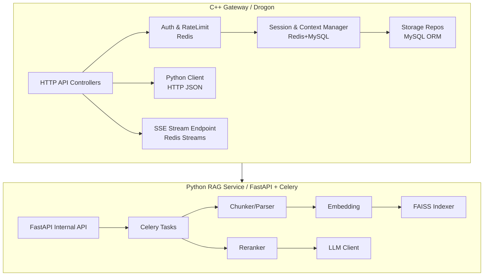
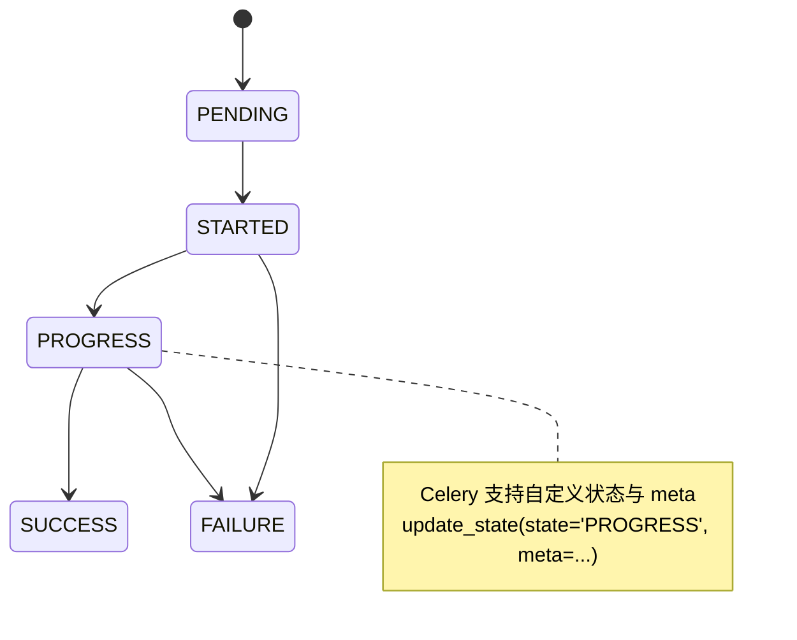
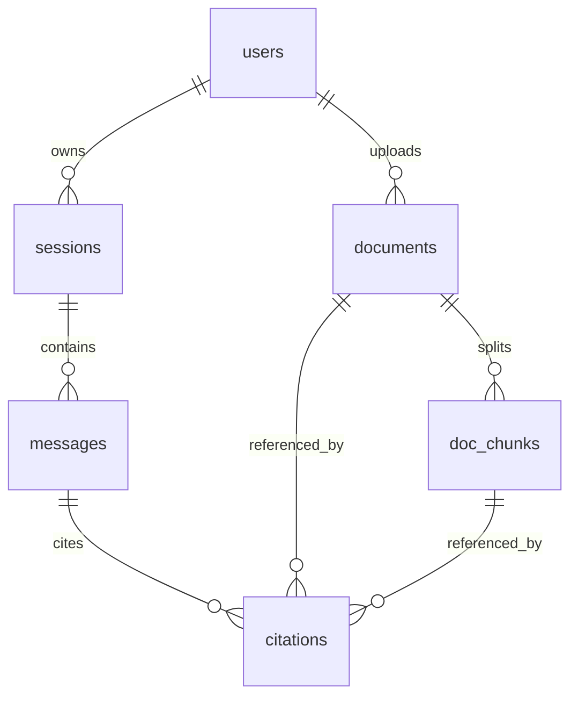

# 在 8 周内交付可本地部署的 C++ + Python + MySQL + Redis + RAG 科研知识增强生成式 AI 系统

## 执行摘要

本报告给出一套可执行的 **8 周单人开发与交付流程**，目标是在本地单机完成一个“科研知识增强生成式 AI 系统”，支持 **文档上传→异步处理→FAISS 检索→多轮问答→引用返回→会话记忆→流式输出（SSE/WebSocket）**，并具备可演示、可复现、可维护的工程结构。整体采用 **双服务架构**：C++（Drogon）负责对外 API、会话/上下文管理、MySQL 持久化与 Redis 状态层；Python（FastAPI + Celery）负责文档处理与 RAG 推理任务编排。该分层能同时满足“工程化交付”和“你希望把 C++ 融入主线”的目标，同时避免把模型生态强行搬到 C++ 导致工期失控。Drogon 作为高性能 C++ Web 框架具备异步特性与会话支持，适合作为网关与业务层。

关键技术决策如下（每项附理由与替代方案）：

| 决策 | 选择 | 理由（简短） | 替代方案（简短） |
|---|---|---|---|
| 服务分层 | C++ Gateway + Python RAG Service | Python 负责模型链路生态最成熟；C++ 负责高并发 API、状态与上下文治理，兼顾工程价值与完成度 | 全 Python（更快但 C++ 价值弱）；全 C++（工期和生态风险高） |
| 异步任务 | Celery + Redis（broker/backend） | Celery 支持任务状态、进度更新与工作流编排；Redis 可同时作为 broker 与 backend，栈更简单  | RQ（更轻，但生态与状态/工作流弱） |
| 向量索引 | FAISS（本地文件索引） | 单机部署最强性价比；官方推荐 Conda 安装，成熟稳定  | Milvus/Weaviate（重）；pgvector（DB 压力大） |
| 流式输出 | SSE（对外）+ Redis Streams（跨服务 token 传递） | SSE 是标准化的 server→client 流式协议，适合 AI chat streaming；Redis Streams 提供追加日志式传递（XADD/XREADGROUP）可解耦推理与网关  | WebSocket（双向更复杂，适合交互）；网关直连 Python 流（Drogon HTTP client 读分块能力存在现实限制与争议） |
| 嵌入与重排 | BGE / E5 作为 embedding；BGE reranker / Cross-Encoder 作为重排 | RAG 范式用“检索+生成”解决知识更新与可追溯引用；Cross-Encoder rerank 能显著提升相关性  | 仅 embedding 不 rerank（质量下降）；BM25（可加作融合，但需额外工程） |

### 第一周按天计划（2026-03-16 ～ 2026-03-22，Asia/Tokyo）

> 负责人假设：你（单人）。原则：**每天至少产出“可运行的最小增量”**（可启动、可调用、可观察日志/状态）。

| 日期 | 目标 | 任务拆解 | 预估工时 | 优先级 | 当日交付物 |
|---|---|---:|---:|---:|---|
| 03/16（周一） | 项目骨架 + 本地依赖一键启动 | 初始化 mono-repo；写 docker-compose（MySQL/Redis）；写 `.env.example`；定义端口与网络；制定命名规范与目录结构；写最小 README | 6h | P0 | `docker compose up -d mysql redis` 可用；README v0.1 |
| 03/17（周二） | C++ Gateway 最小可运行 | Drogon 工程创建；加载 config.json；实现 `/health`；接 MySQL（DbClient）最小查询；接 Redis（redis-plus-plus）最小 set/get | 7h | P0 | Gateway 容器/二进制可启动；健康检查通过  |
| 03/18（周三） | Python 服务骨架 + Celery worker 跑通 | FastAPI `/internal/health`；Celery app 初始化（Redis broker/backend）；定义 demo task；任务状态查询接口 | 6h | P0 | `rag_api` + `celery_worker` 启动；任务可异步执行并查询状态  |
| 03/19（周四） | 文档上传闭环 v1 | Gateway：`POST /v1/documents`（multipart）保存文件；调用 Python `/internal/jobs/ingest` 提交任务；MySQL 写 documents/tasks；Redis 写任务缓存 | 7h | P0 | 上传后返回 `doc_id + task_id`；可查询任务状态  |
| 03/20（周五） | 文档解析与切片（异步） | Python Celery ingest：解析 txt/md；pdf 先用简化策略（后续增强）；切片策略 v1；写 doc_chunks；更新任务进度 | 7h | P0 | `documents.status` 从 `processing→ready`（文本类）；chunks 入库 |
| 03/21（周六） | Embedding + FAISS 索引 v1 | Python：embedding（Sentence-Transformers/FlagEmbedding）；建立 FAISS IndexFlat*；写 `chunk_id↔vector_id` 映射；索引文件落盘 | 6h | P0 | 可对单文档检索 top-k；索引版本化  |
| 03/22（周日） | 首个可问答 MVP（非流式或简易流式） | Gateway：创建 session、写 messages；Python：/chat job（retrieve→rerank→LLM）；先返回完整 JSON；流式先打通“Redis Streams→SSE”骨架 | 8h | P0 | 端到端：上传→索引→提问→返回答案+引用（v0） |

### 首个可运行 MVP 的快速启动命令示例

> 目标：**本地单机**一键起 MySQL、Redis、Python、Worker、C++ Gateway（以及可选本地 LLM Server）。MySQL 官方镜像支持通过环境变量初始化账号/库。
> Docker Compose 可用 `depends_on` + `healthcheck` 控制启动顺序与就绪判断。

```bash
# 1) 准备环境
cp .env.example .env

# 2) 启动基础依赖（MySQL + Redis）
docker compose up -d mysql redis

# 3) （可选）启动本地 LLM Server
# 方案 A：llama-cpp-python OpenAI 兼容服务（便于后续切换模型/客户端）
docker compose up -d llm_server

# 4) 启动 Python RAG API + Celery Worker
docker compose up -d --build rag_api celery_worker

# 5) 启动 C++ Gateway（Drogon）
docker compose up -d --build gateway

# 6) 冒烟测试
curl -s http://localhost:8080/health
curl -s http://localhost:8000/internal/health
```

以上示例中 SSE 作为流式输出协议（`text/event-stream`）能直接服务 AI chat streaming 场景。
如你选择 Redis Streams 做跨服务 token 传递，可用 XADD 追加、XREADGROUP（或 XREAD）消费，且命令复杂度与阻塞特性在官方文档可查。

## 开发计划与里程碑

下面给出 8 周计划（你单人开发），每周含：目标、任务、预估工时、优先级、里程碑交付物与验收点。建议你严格区分 **P0（必须完成）** 与 **P1（有余力再做）**，避免“功能全做但无闭环”。

| 周期 | 周目标 | 任务（浓缩） | 预估工时 | 优先级 | 里程碑交付物 | 周末验收标准 |
|---|---|---|---:|---:|---|---|
| Week 1（03/16-03/22） | 首个端到端 MVP（文档→检索→回答） | 见执行摘要日计划；建立骨架；跑通 ingest/索引/问答 | 40h | P0 | `v0.1` 可用系统 | 端到端成功 3 次；日志可定位失败原因 |
| Week 2 | 引用返回 + MySQL/Redis 结构稳固 | 设计并落库：documents/doc_chunks/messages/tasks/citations；实现 citation 生成；完善任务状态 | 35h | P0 | 数据层 v1 + 引用 v1 | 每条回答返回 ≥1 条引用（chunk_id+snippet） |
| Week 3 | 流式输出闭环（SSE） | Redis Streams token 通道；Gateway SSE endpoint；断线重连（Last-Event-ID 最小支持）；取消生成 | 35h | P0 | Streaming v1 | 前端/命令行可看到 token 流；中断可恢复/结束  |
| Week 4 | 会话记忆（短期/长期）与上下文预算 | Redis 缓存最近 N 轮；MySQL 保存会话 summary；上下文裁剪；定期摘要任务 | 35h | P0 | Context Manager v1 | 长会话（≥50 轮）仍能稳定回答且不丢“系统约束” |
| Week 5 | 文档处理增强与质量提升 | PDF 正式解析（引入更可靠库）；分块策略优化；加入 rerank（Cross-Encoder / bge-reranker） | 35h | P0 | RAG 质量 v1 | 10 个问题中命中引用相关 chunk ≥7（主观验收+日志） |
| Week 6 | 工程化：鉴权、限流、缓存、配置 | API Key/Session；Redis 限流；缓存（embedding/query）；配置文件化（Drogon config） | 30h | P0 | 可对外演示版 beta | 恶意请求（高频）被限流；配置可通过文件修改  |
| Week 7 | Docker 化交付与测试体系 | 完整 docker-compose；健康检查；pytest + C++ 单测/集成测；E2E 脚本 | 35h | P0 | `v1.0-rc` | `docker compose up --build` 15 分钟内完成可用系统 |
| Week 8 | 打磨与演示包装 | README/架构图；Demo 脚本与录屏脚本；性能与风险说明；不足与 roadmap | 25h | P1 | `v1.0` release | 演示 10 分钟无故障；关键卖点可复述 |

补充建议：若你只有 6 周窗口，可以合并 Week 6～7（降低测试深度、先做集成测），但不建议牺牲 Week 3～4（流式与会话记忆是你差异化点，也是你对 “AI 上下文丢失” 的正面回应）。

## 目标、范围与MVP验收标准

### 项目目标

在本地单机部署一个科研知识增强生成式 AI 系统，满足：

- **私有文档知识库**：上传文档→解析切片→向量索引（FAISS）→可检索。
- **RAG 问答**：基于检索结果生成回答，并返回可追溯引用（provenance）。RAG 的“检索 + 生成”范式被提出用于知识密集任务并强调可追溯与知识更新。
- **异步处理**：文档 ingest、索引构建、生成任务长耗时，需要任务队列与状态查询；Celery 支持任务状态与进度更新。
- **多轮会话**：支持会话历史与“会话记忆”（短期+长期摘要），并解决长上下文丢失风险（通过外部记忆与预算管理）。
- **流式输出**：回答过程可 SSE 流式推送（AI chat streaming 常用）。
- **工程化交付**：Docker / docker-compose 一键拉起，可健康检查、可测试、可演示。

### MVP 功能清单与验收标准

> P0：1-2 个月必须完成；P1：做得出来就加分但不能拖主线。

| 功能 | 优先级 | 说明 | 验收标准（可测试） |
|---|---|---|---|
| 本地部署（docker-compose） | P0 | 一键启动 MySQL、Redis、Python、Worker、C++ Gateway（可选 LLM） | `docker compose up --build -d` 后：`/health`、`/internal/health` 返回 200；依赖可通过 `depends_on+healthcheck` 正常就绪  |
| 文档上传 | P0 | 支持 PDF/MD/TXT（起步可先 TXT/MD） | 上传返回 `doc_id`；文件落盘；DB 记录 `documents.status=uploaded/processing` |
| 异步 ingest | P0 | 解析→切片→写库→embedding→FAISS 索引 | 返回 `task_id`；`GET /tasks/{id}` 可见状态从 PENDING/STARTED→SUCCESS/FAILURE；支持进度 meta（update_state） |
| FAISS 检索 | P0 | 至少 IndexFlat（L2 或 IP）实现 top-k | 给定 query 返回 top-k chunk（含 chunk_id 与 score）；索引文件可在本地重载  |
| Rerank（重排） | P0 | Cross-Encoder rerank top-k 提升相关性 | 对同一 query：启用 rerank 后 top-3 相关性主观提升；日志记录 rerank 前后排名；Cross-Encoder 用于 rerank 是官方推荐范式  |
| LLM 生成回答 | P0 | 本地开源 LLM，通过统一接口调用（OpenAI-like） | 给定检索上下文返回回答文本；若用 llama-cpp-python，可用 OpenAI 兼容 server 快速接入  |
| 引用返回（Provenance） | P0 | 答案附带引用 chunk（doc、chunk、snippet） | 每条 assistant 消息保存 citations；响应 JSON 至少含 `citations[]`（doc_id、chunk_id、offset/snippet） |
| 多轮会话 | P0 | session/messages 持久化；支持继续对话 | `GET /sessions/{sid}/messages` 返回历史；会话可恢复 |
| 会话记忆（短期+长期） | P0 | Redis 缓存最近 N 轮；MySQL 保存会话 summary；上下文裁剪 | 在 ≥50 轮对话中仍能保持系统约束（如“必须引用”）不丢失；日志展示上下文预算分配 |
| 流式输出 SSE | P0 | token 流式下发；带完成/错误事件 | 客户端能逐步收到 token；`event: done` 或最终 `data` 标记结束；SSE 字段（data/event/id/retry）符合规范  |
| 基础鉴权与限流 | P1 | API Key 或 session token；Redis 计数器限流 | 对同一 key 高频请求被 429；Redis TTL/EXPIRE 生效  |
| 取消生成 | P1 | revoke/stop 任务或标记取消 | 调用取消接口后 SSE 返回 `event: cancelled`；任务状态进入 REVOKED/自定义 cancelled  |

## 技术架构与数据流

### 总体架构图（C++ 网关 + Python RAG + Celery + Redis Streams）

```mermaid
flowchart LR
  U[用户/前端<br/>Web/CLI] -->|HTTP JSON / SSE| G[C++ Gateway<br/>Drogon]

  G -->|ORM/SQL| M[(MySQL<br/>metadata/messages)]
  G -->|cache/limit/session| R[(Redis)]

  G -->|内部HTTP: 提交任务/查状态| P[Python Control API<br/>FastAPI]
  P -->|enqueue| C[Celery Worker<br/>Redis broker/backend]
  C -->|写入chunks/状态| M
  C -->|写入向量索引| F[(FAISS Index Files)]
  C -->|XADD token流| RS[(Redis Streams<br/>chat:stream:*)]

  G -->|XREAD(XREADGROUP)| RS
  C -->|调用生成| L[本地LLM服务<br/>llama.cpp/llama-cpp-python]
```

该设计刻意让“跨服务流式 token”走 Redis Streams（XADD/XREADGROUP），避免网关必须从 Python 通过 HTTP 客户端读取分块响应；在 Drogon 生态中，HTTP client 读取分块流的诉求长期存在讨论，工程上用 Redis Streams 解耦可显著降低不确定性。

### 模块关系图（推荐的代码分层）



Drogon 支持会话（Session）与配置文件加载，也支持文件上传解析（MultiPartParser/HttpFile），适合承载上传入口与会话治理。

### 异步任务状态流（文档 ingest 与生成）



Celery 官方示例支持在任务内通过 `update_state` 上报自定义进度状态与 meta，这使“上传→处理中→就绪”可被 API 查询并展示。

## 接口协议与API清单

### C++ ↔ Python 内部接口协议

**选择：HTTP + JSON（内部私网/同机容器网络）**
理由：实现与调试成本最低（curl 直接测）；与 Celery 解耦（Python 负责 enqueue 与任务状态封装）；避免跨语言复刻 Celery broker 协议。Celery 消息序列化虽默认 JSON，但跨语言直接写入 broker 需要匹配协议细节，性价比不高。
替代：gRPC（更强类型/性能更好，但 proto 与流式更费时）；直接共享 broker 协议（风险大且难测）。

#### 内部接口：提交文档 ingest 任务

- **POST** `/internal/jobs/ingest`
- Content-Type: `application/json`

请求 JSON（示例）：
```json
{
  "doc_id": 123,
  "storage_path": "/data/uploads/2026-03-19/report.pdf",
  "mime": "application/pdf",
  "options": {
    "chunk_size": 800,
    "chunk_overlap": 120,
    "language": "zh"
  }
}
```

响应 JSON（示例）：
```json
{
  "task_id": "celery-uuid-xxx",
  "status_url": "/internal/tasks/celery-uuid-xxx"
}
```

#### 内部接口：提交 chat completion 任务（支持流式）

- **POST** `/internal/jobs/chat`
- Content-Type: `application/json`

请求 JSON（示例）：
```json
{
  "session_id": 456,
  "message_id": 789,
  "query": "请总结文档的实验设置，并指出可能的误差来源。",
  "retrieval": {
    "top_k": 30,
    "rerank_top_k": 10
  },
  "stream": {
    "redis_stream_key": "chat:stream:789"
  }
}
```

响应 JSON（示例）：
```json
{
  "task_id": "celery-uuid-yyy",
  "stream_key": "chat:stream:789",
  "status_url": "/internal/tasks/celery-uuid-yyy"
}
```

#### 内部接口：查询任务状态

- **GET** `/internal/tasks/{task_id}`

响应（示例）：
```json
{
  "task_id": "celery-uuid-yyy",
  "state": "PROGRESS",
  "meta": { "progress": 60, "stage": "embedding" },
  "updated_at": "2026-03-20T13:31:00+09:00"
}
```

Celery 任务状态与结果查询是其标准能力；内置状态包括 PENDING/STARTED/RETRY/FAILURE/SUCCESS，自定义状态可插入在 STARTED 与 SUCCESS/FAILURE 之间。

### 对外 API（C++ Gateway）列表

| 类别 | Method | Path | 说明 | 鉴权 |
|---|---|---|---|---|
| 健康检查 | GET | `/health` | 网关健康 | 无 |
| 上传文档 | POST | `/v1/documents` | multipart 上传，返回 doc_id + ingest_task_id | API Key（P1） |
| 查询文档 | GET | `/v1/documents/{doc_id}` | 文档元信息与状态 | API Key（P1） |
| 查询任务 | GET | `/v1/tasks/{task_id}` | 透传/聚合 Celery 任务状态 | API Key（P1） |
| 创建会话 | POST | `/v1/sessions` | 新建 session | API Key（P1） |
| 发起问答 | POST | `/v1/sessions/{sid}/messages` | 写入 user 消息 + 触发生成任务 | API Key（P1） |
| 拉取历史 | GET | `/v1/sessions/{sid}/messages` | 返回消息列表 | API Key（P1） |
| 流式输出 | GET | `/v1/sessions/{sid}/messages/{mid}/stream` | SSE 输出 token 与最终结果 | API Key（P1） |
| 取消生成 | POST | `/v1/sessions/{sid}/messages/{mid}/cancel` | 中止任务/标记取消 | API Key（P1） |

### SSE 事件格式（对外流式输出）

SSE 是标准的 HTTP 流式文本协议，事件由 `data/event/id/retry` 等字段组成，适用于 AI chat streaming。

建议你的 SSE 负载统一为 JSON（便于前端解析），定义事件类型：

- `event: token`：增量 token
- `event: done`：最终完成（含 citations、usage、trace）
- `event: error`：失败信息（含可重试建议）

示例（概念）：
```
event: token
data: {"delta":"实验设置包括...","message_id":789}

event: done
data: {"message_id":789,"citations":[{"doc_id":123,"chunk_id":55}],"finish_reason":"stop"}
```

## 数据持久化与缓存设计

### MySQL 表设计（ER 表格 + 约束说明）

设计原则：

- 使用 InnoDB（事务与外键约束更适合业务一致性）。MySQL 的外键与约束在 InnoDB 下可用。
- 每张表定义主键；InnoDB 使用 PRIMARY KEY 作为 clustered index，有利于常见查询与写入性能。
- 外键引用列需有合适索引；MySQL 文档对外键与索引要求有明确说明。

#### 核心表（建议 v1）

| 表 | 用途 | 关键字段（建议） | 索引与约束（建议） |
|---|---|---|---|
| `users` | 用户 | `id`(PK), `username`(UNIQUE), `password_hash`, `created_at` | `UNIQUE(username)` |
| `sessions` | 会话 | `id`(PK), `user_id`(FK), `title`, `summary`, `created_at`, `updated_at` | `INDEX(user_id, updated_at)`；FK→users.id |
| `messages` | 消息 | `id`(PK), `session_id`(FK), `role`, `content`, `status`, `created_at` | `INDEX(session_id, created_at)`；FK→sessions.id |
| `documents` | 文档元信息 | `id`(PK), `user_id`(FK), `filename`, `mime`, `sha256`, `size_bytes`, `storage_path`, `status`, `created_at` | `UNIQUE(user_id, sha256)`；`INDEX(status, created_at)` |
| `doc_chunks` | 文档切片 | `id`(PK), `doc_id`(FK), `chunk_index`, `text`, `tokens_est`, `vector_id` | `UNIQUE(doc_id, chunk_index)`；`INDEX(doc_id)` |
| `vector_indexes` | 索引版本 | `id`(PK), `scope`(如 user/kb), `faiss_path`, `dim`, `metric`, `version`, `updated_at` | `UNIQUE(scope, version)` |
| `tasks` | 异步任务 | `id`(PK), `celery_task_id`(UNIQUE), `type`, `entity_type`, `entity_id`, `state`, `meta_json`, `error`, `created_at`, `updated_at` | `INDEX(entity_type, entity_id)` |
| `citations` | 引用记录 | `id`(PK), `message_id`(FK), `doc_id`(FK), `chunk_id`(FK), `rank`, `score`, `snippet` | `INDEX(message_id, rank)` |

> 如果你只做单用户 demo，可暂时弱化 `users` 与权限，但建议保留字段，为后续扩展铺路。

#### ER 关系图（辅助）



### Redis 键设计表格（缓存/限流/流式通道）

Redis 设计原则：

- **高频短期状态**放 Redis；需过期的 key 用 EXPIRE/SET EX，Redis 官方命令支持设置超时并自动删除。
- Streams 用作“追加日志式”的 token 通道，producer 用 XADD，consumer 用 XREAD/XREADGROUP（支持阻塞读取）。

| Key Pattern | 类型 | TTL | 写入方 | 读取方 | 用途 |
|---|---|---:|---|---|---|
| `auth:token:{token}` | string | 24h | Gateway | Gateway | API Key / session token 映射 user_id（P1） |
| `rl:{user_id}:{route}:{window}` | string | window 秒 | Gateway | Gateway | 限流计数器（P1） |
| `sess:recent:{session_id}` | list | 7d（可选） | Gateway | Gateway | 最近 N 条消息的 compact JSON（短期记忆） |
| `chat:stream:{message_id}` | stream | 1d（完成后设置） | Worker | Gateway SSE | token 流式通道（XADD/XREADGROUP） |
| `task:cache:{task_id}` | hash | 15m | Python API | Gateway | 任务状态 hot cache（减少打 Celery backend） |
| `lock:doc:{doc_id}` | string | 60s | Worker | Worker | 文档 ingest 幂等锁（防重复消费） |
| `cache:embed:q:{hash}` | string/blob | 30m | Worker | Worker | query embedding 缓存（P1） |

## 实现要点与关键代码示例

> 说明：以下代码片段以“可落地”为目标，强调关键点与接口形状；你需要按项目目录与依赖做适配。引用的框架能力来自官方文档/示例。

### C++ 服务（Drogon）实现要点

**框架选择：Drogon**
Drogon 是 C++17/20 Web 框架，强调异步与高性能；支持会话、配置文件与文件上传解析。

#### 配置文件与启动（config.json + loadConfigFile）

Drogon 推荐通过配置文件配置监听端口、日志、数据库等，`loadConfigFile()` 在 `run()` 前调用。

```cpp
// main.cc (示意)
#include <drogon/drogon.h>

int main() {
  drogon::app().loadConfigFile("config.json");
  drogon::app().run();
}
```

#### 文件上传（MultiPartParser/HttpFile）

Drogon Wiki 给出 `MultiPartParser` 用于解析 multipart 请求、`getFiles()` 获取上传文件对象。

```cpp
// DocumentsController::upload (示意)
void upload(const drogon::HttpRequestPtr& req,
            std::function<void (const drogon::HttpResponsePtr&)>&& cb) {

  drogon::MultiPartParser parser;
  if (parser.parse(req) != 0 || parser.getFiles().empty()) {
    auto resp = drogon::HttpResponse::newHttpJsonResponse({{"error","no file"}});
    resp->setStatusCode(drogon::k400BadRequest);
    return cb(resp);
  }

  auto& file = parser.getFiles()[0];
  // ⚠️ 风险点：原始文件名可能引发路径穿越（建议自行做 basename/白名单后缀）
  // 有已知上传文件名处理不当导致任意文件写入的安全风险案例，应做防护。
  file.save("/data/uploads/...");
  // 写 MySQL：documents 记录；调用 Python /internal/jobs/ingest
}
```

Drogon 示例也展示了 `MultiPartParser` 与 `file.save()` 的基本用法，可作为你实现参考。

#### MySQL 访问（DbClient / 事务）

Drogon 的 DbClient 支持同步与异步接口，异步更契合其整体异步模型；每个 DbClient 有 event loop 线程负责数据库 IO。
事务对象可由 DbClient 创建，并在析构时自动 commit/rollback。

```cpp
// Repo 层伪代码：插入 messages
auto client = drogon::app().getDbClient(); // 需在 config.json 配置 db_clients
client->execSqlAsync(
  "INSERT INTO messages(session_id, role, content, status) VALUES(?,?,?,?)",
  [](const drogon::orm::Result& r){ /* ok */ },
  [](const drogon::orm::DrogonDbException& e){ /* log */ },
  sessionId, "user", content, "created"
);
```

#### Redis 交互（建议 redis-plus-plus）

`redis-plus-plus` 是常用 C++ Redis 客户端（基于 hiredis），支持连接池等；其 README 说明可用 CMake FetchContent 集成。

```cpp
#include <sw/redis++/redis++.h>

sw::redis::Redis redis("tcp://redis:6379");

// 限流计数器（示意）
auto key = "rl:uid:route:window";
auto v = redis.incr(key);
if (v == 1) {
  redis.expire(key, 10); // 10s 窗口
}
```

Redis 的 EXPIRE/SET EX 语义与 TTL 行为可参考官方命令文档。

#### SSE 流式输出（Gateway 从 Redis Streams 读取）

设计点：Worker 把 token 持续写入 Redis Stream（XADD），Gateway SSE endpoint 用阻塞读取（XREADGROUP 或 XREAD）不断向客户端输出。Redis Streams 的命令语义与复杂度在官方文档给出。

> Drogon 本身有“流式响应”相关能力，但社区也讨论过实现细节（例如示例里用线程发送分块会引入线程开销风险）。因此建议你把“token producer”放在 Python Worker，而 C++ 仅消费 Redis Streams 并向客户端 SSE 输出，结构更稳。

（示意伪代码：重点是事件格式与循环结构）
```cpp
// GET /v1/sessions/{sid}/messages/{mid}/stream
// 伪代码：实现方式可用 chunked response 或框架流式接口封装
void streamAnswerSSE(...) {
  // 1) 设置响应头 Content-Type: text/event-stream
  // 2) last_id 从 Last-Event-ID 或 query 参数获取
  // 3) 循环 XREADGROUP 读取 chat:stream:{mid}
  // 4) 每条消息输出：
  //    event: token\n
  //    data: {...}\n\n
  // 5) 收到 done/error 后结束并 close
}
```

SSE 字段与事件结构参考 FastAPI SSE 教程与规范说明；你对外只要遵循同样的事件语义即可。

#### Drogon 构建与测试指令（建议）

- Build：CMake + Ninja（或 Make）
- 依赖：Drogon、MySQL client、redis-plus-plus（含 hiredis）
- 最小化：先用 Docker 镜像或 vcpkg/conan 简化依赖（可选）。Drogon 官方提供 Docker 镜像，便于在 1-2 个月内快速稳定构建环境。

示例（概念）：
```bash
cmake -S cpp_gateway -B build -DCMAKE_BUILD_TYPE=Release
cmake --build build -j
ctest --test-dir build
```

### Python 服务（FastAPI）实现要点

**框架选择：FastAPI**
FastAPI 是高性能 Python API 框架，面向生产可用。

#### 文件上传与表单依赖

FastAPI 接收上传文件使用 `UploadFile`/`File`；处理 multipart 需要安装 `python-multipart`。

#### Celery 配置（Redis broker/backend）

Celery 文档明确：Redis 可同时作为 broker 与 backend；并提供 Redis backend 相关配置项。

另外，Celery 默认 JSON serializer（v4+），pickle 虽方便但存在安全风险，应避免在不可信场景使用。

#### 任务进度与状态

Celery 任务可以通过 `update_state(state='PROGRESS', meta=...)` 上报进度；Works well for ingest/index 这类长任务。

#### Embedding 与 Rerank

- Sentence-Transformers 提供 embedding 计算与 cross-encoder rerank 能力。
- BGE reranker 描述了典型“先 embedding 检索 top-k，再用 reranker 重排 top-k”的平衡方案，并提供 FlagEmbedding 用法。
- E5 论文说明其作为通用 embedding 家族在检索任务表现强。

#### FAISS 索引

FAISS 官方文档推荐用 Conda 安装 `faiss-cpu/faiss-gpu`，常见索引可在本地加载与检索。

#### LLM 调用（本地）

- `llama.cpp` 提供本地推理能力；其 server 文档说明了轻量 HTTP server 与 REST API。
- `llama-cpp-python` 提供 OpenAI API 兼容 server，利于你在系统层面稳定接口（后续也可替换成 Ollama/vLLM）。

### 异步任务设计（Celery + Redis）与任务状态流

建议将任务分为两类（都由 Python 负责执行，C++ 只负责提交与聚合状态）：

1) **IngestDocumentTask**：解析→切片→embedding→FAISS 更新→写 DB 状态
2) **ChatCompletionTask**：检索→rerank→构造 prompt→调用 LLM→输出 token 到 Redis Streams→落库最终结果

Chat 流式输出的核心是：
- Worker：对每个 token（或每 N token batch）XADD 写入 `chat:stream:{message_id}`
- Gateway：SSE endpoint 阻塞读取（XREADGROUP/XREAD）并立即向客户端推送
XADD/XREADGROUP 的语义与常见使用模式在 Redis 官方 Streams 文档中定义。

## 部署、测试、可观测性与交付物

### Docker / docker-compose 配置示例（骨架）

关键点：

- `depends_on` 只能保证启动顺序，真正“就绪”建议配合 `healthcheck`。官方 Compose 文档强调启动顺序控制方式。
- MySQL 官方镜像通过环境变量初始化 root 密码/数据库等（首次启动且数据目录为空时生效）。
- Redis 官方给出 Docker 运行方式与文档。

（示意 `docker-compose.yml` 片段）
```yaml
services:
  mysql:
    image: mysql:8.0
    environment:
      MYSQL_ROOT_PASSWORD: ${MYSQL_ROOT_PASSWORD}
      MYSQL_DATABASE: ${MYSQL_DATABASE}
    healthcheck:
      test: ["CMD", "mysqladmin", "ping", "-p${MYSQL_ROOT_PASSWORD}"]
      interval: 5s
      timeout: 3s
      retries: 20

  redis:
    image: redis:7
    healthcheck:
      test: ["CMD", "redis-cli", "ping"]
      interval: 3s
      timeout: 2s
      retries: 30

  rag_api:
    build: ./python_rag
    depends_on:
      mysql:
        condition: service_healthy
      redis:
        condition: service_healthy

  celery_worker:
    build: ./python_rag
    command: celery -A app.celery_app worker -l INFO
    depends_on:
      rag_api:
        condition: service_started

  gateway:
    build: ./cpp_gateway
    depends_on:
      mysql:
        condition: service_healthy
      redis:
        condition: service_healthy
```

### 测试计划（单元测试 / 集成测试 / 端到端验收）

#### Python 单元测试

FastAPI 推荐使用 `TestClient`（基于 httpx）进行测试；文档给出安装与使用方式。

建议用例（示例）：

| 级别 | 用例 | 断言 |
|---|---|---|
| Unit | chunker 输入长文本 | 切片数、重叠、最大长度满足规则 |
| Unit | embedding 输出维度 | dim 与索引匹配 |
| Unit | rerank 排序 | score 单调与 top-k 选择 |
| API | `/internal/jobs/ingest` | 返回 task_id，状态可查询 |
| API | `/internal/tasks/{id}` | state/meta 格式正确 |

#### C++ 单元/集成测试

建议至少实现“黑盒集成测”（curl/脚本即可），并在 Week 7 补充 C++ 单测框架（Catch2/GoogleTest 任选）。Drogon 本身有配置文件化与日志能力可帮助观察。

#### 端到端验收测试（E2E）

定义 3 条“必须通过”的验收脚本（你可以写成 `scripts/e2e_demo.sh`）：

1) 上传 md/txt → ingest SUCCESS → 检索可命中
2) 创建 session → 发起问答 → 返回答案 + citations（非空）
3) 同一 session 多轮问答 + SSE 流式输出不断线（至少 30 秒）

### 监控与日志建议

- Gateway：请求日志、trace_id（建议 message_id/task_id 贯穿）、慢请求统计。Drogon 的线程模型基于 event loop，建议避免在 handler 里做阻塞操作，把重活下沉到 Celery。
- Redis：关注 keyspace 增长与 streams 长度；设置过期策略，避免无限增长（EXPIRE/TTL）。
- Redis 性能：Redis 官方提到网络延迟与 CPU 会直接影响性能，可用 `redis-benchmark` 或简单 ping 验证链路。

### 风险清单与缓解措施

| 风险 | 触发场景 | 影响 | 缓解措施 |
|---|---|---|---|
| 文档上传安全（路径穿越/任意写） | 直接用原始文件名保存 | 高危 | 只用生成文件名；后缀白名单；禁止 `..`；严格上传目录；参考已披露风险案例  |
| Redis 任务/流占用无限增长 | streams/list 不 trim、不 expire | 内存爆 | 完成后 EXPIRE；streams XTRIM（P1）；定期清理任务与 token |
| Celery serializer 安全 | 使用 pickle 且 broker 暴露 | 高危 | 强制 JSON serializer；`accept_content=['json']`；Celery 对 pickle 风险有明确警告  |
| 流式输出不稳定 | SSE 断线/代理缓冲 | 中 | 加心跳事件；支持 Last-Event-ID；对外用 SSE 标准字段  |
| 向量索引与 DB 映射错位 | vector_id 映射错误 | 中 | 映射表不可变；索引版本化；重建流程可重复 |
| 性能不足（CPU 推理慢） | 本地 LLM/ rerank 大模型 | 中 | 默认用小模型/量化；rerank 限制 top-k；缓存 query embedding；并发限流 |
| 依赖启动顺序 | MySQL 未就绪导致服务启动失败 | 中 | Compose healthcheck + depends_on；官方有启动顺序控制说明  |

### 性能估算与优化建议（单机）

> 下述为“工程估算区间”，受 CPU/GPU、模型大小、上下文长度影响显著；建议 Week 8 用真实硬件做一次 profiling。

- **检索链路**：embedding（短 query）+ FAISS top-k 通常明显快于 LLM 生成阶段；优化重点在 batching 与缓存。FAISS 以高效相似度检索为目标，C++ 实现并提供 Python wrapper。
- **rerank 开销**：Cross-Encoder 需要对（query, doc）成对打分，代价高于 bi-encoder；因此只 rerank embedding 召回的 top-k 是常见做法。
- **流式输出**：Redis Streams 阻塞读写适合日志/队列；XREAD/XREADGROUP 的复杂度在官方文档给出，可通过控制 COUNT 与阻塞参数降低开销。
- **网关高并发**：Drogon 强调异步与低开销；但流式响应实现方式需避免“每连接一线程”这类模型（社区已讨论潜在瓶颈）。

### 最终交付物清单

#### 代码仓库结构（建议）

```text
repo/
  cpp_gateway/
    CMakeLists.txt
    config/config.json
    src/
      main.cc
      controllers/
      services/
      repos/
      middleware/
      utils/
    tests/
    Dockerfile
  python_rag/
    app/
      main.py
      api/
      celery_app.py
      tasks/
      rag/
      store/
    tests/
    requirements.txt
    Dockerfile
  db/
    migrations/
    schema.sql
  scripts/
    e2e_demo.sh
    bench.sh
    seed_data.sh
  docker-compose.yml
  .env.example
  README.md
```

#### README 模板（必须包含）

- 项目简介（1 段话）
- 架构图（mermaid）与模块说明
- 快速启动（`docker compose up --build -d`）
- Demo 路径（上传→问答→流式）
- API 文档（关键 endpoint 与示例）
- 数据库说明（表、索引、迁移方式）
- 性能与已知限制
- Roadmap（下一步要做的 5 件事）

#### 演示脚本（Demo Script）

建议准备一份“10 分钟稳定演示”的脚本，顺序固定：

1) 启动服务（输出健康检查）
2) 上传一个短文档（md/txt）→展示任务状态（PENDING→PROGRESS→SUCCESS）
3) 创建 session → 提问 → 展示 SSE token 流（终止后返回 citations）
4) 第二轮追问（验证会话记忆/上下文保持）
5) 打开 MySQL 查看 messages/citations（证明可追溯与可审计）

#### Demo 录制脚本（建议）

- 终端录制：`asciinema rec`（或 OBS 全屏录制）
- 录制前跑 `scripts/e2e_demo.sh` 确保无报错
- 录制内容中必须出现：`docker compose up`、`/health`、上传、流式回答、引用 JSON、数据库查询结果

#### 项目亮点说明（用于简历/答辩）

- **C++ 网关治理上下文**：你把“AI 窗口记忆不足”的问题工程化解决（短期缓存 + 长期摘要 + 上下文预算）
- **Redis Streams 流式桥接**：推理解耦、可恢复、可观察（token 作为事件流）
- **RAG 可追溯引用**：每条回答都有可审计 provenance（chunk 级引用）——符合 RAG 强调 provenance 的目标
- **工程化可交付**：docker-compose 一键启动、健康检查、测试用例与 E2E 脚本，具备“可复现交付物”的完整形态
