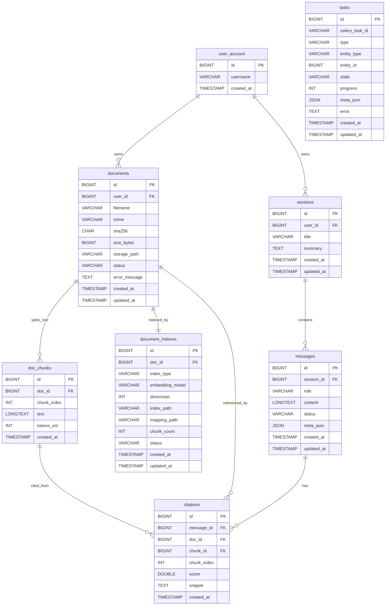

```mermaid
erDiagram
    user_account ||--o{ documents : owns
    user_account ||--o{ sessions : owns

    documents ||--o{ doc_chunks : splits_into
    documents ||--|| document_indexes : indexed_by
    documents ||--o{ citations : referenced_by

    sessions ||--o{ messages : contains
    messages ||--o{ citations : has

    doc_chunks ||--o{ citations : cited_from

    user_account {
        BIGINT id PK
        VARCHAR username
        TIMESTAMP created_at
    }

    documents {
        BIGINT id PK
        BIGINT user_id FK
        VARCHAR filename
        VARCHAR mime
        CHAR sha256
        BIGINT size_bytes
        VARCHAR storage_path
        VARCHAR status
        TEXT error_message
        TIMESTAMP created_at
        TIMESTAMP updated_at
    }

    doc_chunks {
        BIGINT id PK
        BIGINT doc_id FK
        INT chunk_index
        LONGTEXT text
        INT tokens_est
        TIMESTAMP created_at
    }

    document_indexes {
        BIGINT id PK
        BIGINT doc_id FK
        VARCHAR index_type
        VARCHAR embedding_model
        INT dimension
        VARCHAR index_path
        VARCHAR mapping_path
        INT chunk_count
        VARCHAR status
        TIMESTAMP created_at
        TIMESTAMP updated_at
    }

    sessions {
        BIGINT id PK
        BIGINT user_id FK
        VARCHAR title
        TEXT summary
        TIMESTAMP created_at
        TIMESTAMP updated_at
    }

    messages {
        BIGINT id PK
        BIGINT session_id FK
        VARCHAR role
        LONGTEXT content
        VARCHAR status
        JSON meta_json
        TIMESTAMP created_at
        TIMESTAMP updated_at
    }

    citations {
        BIGINT id PK
        BIGINT message_id FK
        BIGINT doc_id FK
        BIGINT chunk_id FK
        INT chunk_index
        DOUBLE score
        TEXT snippet
        TIMESTAMP created_at
    }

    tasks {
        BIGINT id PK
        VARCHAR celery_task_id
        VARCHAR type
        VARCHAR entity_type
        BIGINT entity_id
        VARCHAR state
        INT progress
        JSON meta_json
        TEXT error
        TIMESTAMP created_at
        TIMESTAMP updated_at
    }
```
